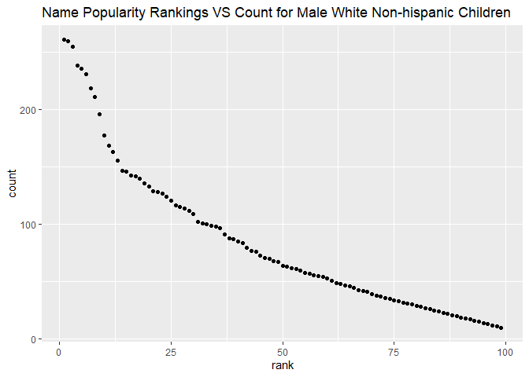

p8105\_hw2\_ew2717
================
Eric Wang

## Problem 1

#### Importing data from Mr. Trash Wheel, cleaning the data, and then filtering it.

``` r
trash_wheel_data <-
  read_excel("data/Trash-Wheel-Collection-Totals-7-2020-2.xlsx",
  sheet = "Mr. Trash Wheel",
  range = "A2:N408") %>% 
  janitor::clean_names() %>% 
  filter(!str_detect(month,'Total')) %>% 
  mutate(sports_balls = round(sports_balls))
```

#### Importing data from 2018 Precipitation, cleaning the data, and then filtering it.

``` r
precipitation_2018_data <-
  read_excel("data/Trash-Wheel-Collection-Totals-7-2020-2.xlsx",
  sheet = "2018 Precipitation",
  range = "A2:B15") %>% 
  janitor::clean_names() %>% 
  mutate(year = 2018) %>% 
  drop_na()
```

#### Importing data from 2019 Precipitation, cleaning the data, and then filtering it.

``` r
precipitation_2019_data <-
  read_excel("data/Trash-Wheel-Collection-Totals-7-2020-2.xlsx",
  sheet = "2019 Precipitation",
  range = "A2:B15") %>% 
  janitor::clean_names() %>% 
  mutate(year = 2019) %>% 
  drop_na()
```

#### Combining the data from 2018 Precipitation and 2019 Precipitation.

``` r
precipitation_combined_data <-
  bind_rows(precipitation_2018_data, precipitation_2019_data) %>% 
  mutate(month = month.name[month]) %>% 
  relocate(year, month, total)
```

#### Data Observations.

``` r
precipitation2018_names = precipitation_2018_data %>% names()
precipitation2019_names = precipitation_2019_data %>% names()
precipitation2018_total = precipitation_2018_data %>% summarise(sum(total))
precipitation2019_total = precipitation_2019_data %>% summarise(sum(total))
precipitation2018_median = precipitation_2018_data %>% summarise(median(total))
precipitation2019_median = precipitation_2019_data %>% summarise(median(total))
precipitation2018_mean = precipitation_2018_data %>% summarise(mean(total))
precipitation2019_mean = precipitation_2019_data %>% summarise(mean(total))
precipitation2018_row = precipitation_2018_data %>% nrow()
precipitation2019_row =  precipitation_2019_data %>% nrow()
precipitation2018_col = precipitation_2018_data %>% ncol()
precipitation2019_col = precipitation_2019_data %>% ncol()
```

The variable names for the 2018 precipitation data set are **month,
total, year**, and the variable names for the 2019 precipitation data
set are **month, total, year**. The total amount of precipitation in
2018 was **70.33**, and the total amount of precipitation in 2019 was
**33.95**.The mean amount of precipitation in 2018 was **5.8608333**,
and the mean amount of precipitation in 2019 was **2.8291667**. The
median amount of precipitation in 2018 was **5.455**, and the median
amount of precipitation in 2019 was **3.335**. The total number of rows
in the 2018 precipitation data set is **12**, and the total number of
rows in the 2019 precipitation data set is **12**. Lastly, the total
number of columns in the 2018 precipitation data set is **3**, and the
total number of columns in the 2019 precipitation data set is **3**.

## Problem 2

#### Importing data from FiveThirtyEight, specifically pols-month, and cleaning it.

``` r
pols_month_data <- 
  read_csv("data/fivethirtyeight_datasets/pols-month.csv") %>%
  janitor::clean_names() %>%
  separate(col = mon, into = c("year","month", "day")) %>% 
  mutate(across(.col = c(year, month, day), as.integer)) %>% 
  mutate(month = month.name[month]) %>% 
  mutate(president = case_when(prez_gop == 1 ~ "gop", prez_gop == 2 ~ "gop", prez_dem == 1 ~ "dem")) %>% 
  select(-day, -prez_dem, -prez_gop) %>% 
  select(year, month, president, everything())
```

    ## Rows: 822 Columns: 9

    ## -- Column specification --------------------------------------------------------
    ## Delimiter: ","
    ## dbl  (8): prez_gop, gov_gop, sen_gop, rep_gop, prez_dem, gov_dem, sen_dem, r...
    ## date (1): mon

    ## 
    ## i Use `spec()` to retrieve the full column specification for this data.
    ## i Specify the column types or set `show_col_types = FALSE` to quiet this message.

#### Importing data from FiveThirtyEight, specifically snp, and cleaning it.

``` r
snp_data <- 
  read_csv("data/fivethirtyeight_datasets/snp.csv") %>%
  janitor::clean_names() %>% 
  separate(date, sep = "/", into = c("month", "day", "year")) %>%
  mutate(across(.cols = c("month", "day", "year"), as.integer)) %>%
  mutate(month = month.name[month]) %>%
  mutate(year = ifelse(year > 21, 1900 + year, 2000 + year)) %>%
  select(year, month, close)
```

    ## Rows: 787 Columns: 2

    ## -- Column specification --------------------------------------------------------
    ## Delimiter: ","
    ## chr (1): date
    ## dbl (1): close

    ## 
    ## i Use `spec()` to retrieve the full column specification for this data.
    ## i Specify the column types or set `show_col_types = FALSE` to quiet this message.

#### Importing data from FiveThirtyEight, specifically unemployment, and cleaning it.

``` r
unemployment_data <- 
  read_csv("data/fivethirtyeight_datasets/unemployment.csv") %>%
  janitor::clean_names() %>%
  pivot_longer(
  jan:dec,
  names_to = "month", 
  values_to = "percentage") %>% 
  mutate(across(.col = c(year), as.integer)) %>% 
  mutate(month = recode(month, "jan" = "January", "feb" = "February", "mar" = "March", "apr" = "April", "may" = "May", "jun" = "June", "jul" = "July", "aug" = "August", "sep" = "September", "oct" = "October", "nov" = "November", "dec" = "December"))
```

    ## Rows: 68 Columns: 13

    ## -- Column specification --------------------------------------------------------
    ## Delimiter: ","
    ## dbl (13): Year, Jan, Feb, Mar, Apr, May, Jun, Jul, Aug, Sep, Oct, Nov, Dec

    ## 
    ## i Use `spec()` to retrieve the full column specification for this data.
    ## i Specify the column types or set `show_col_types = FALSE` to quiet this message.

#### Combining the pols and snp data.

``` r
pols_snp_merged <-
  left_join(pols_month_data, snp_data, by = c("year", "month"))
```

#### Combining newly constructed data and umeployment data.

``` r
final_merged <-
  left_join(pols_snp_merged, unemployment_data, by = c("year", "month"))
```

#### Data Observations

``` r
pols_names = pols_month_data %>% names()
pols_dimension = pols_month_data %>%  dim()
pols_yrrange = pols_month_data %>% 
  select(year) %>% 
  range()

snp_names = snp_data %>% names()
snp_dimension = snp_data %>% dim()
snp_yrrange = snp_data %>% 
  select(year) %>% 
  range()

unemployment_names = unemployment_data %>% names()
unemployment_dimension = unemployment_data %>% dim()
unemployment_yrrange = unemployment_data %>% 
  select(year) %>% 
  range()
```

The pols-month data set contains data regarding politicians and whether
they are democratic or republican. The important variables are **year,
month, president, gov\_gop, sen\_gop, rep\_gop, gov\_dem, sen\_dem,
rep\_dem**. The dimensions for the data set are **822, 9**. The range of
years for the data set are **1947, 2015**.

The snp data set contains data that regarding Standard & Poor’s stock
market index. The important variables are **year, month, close**. The
dimensions for the data set are **787, 3**. The range of years for the
data set are **1950, 2015**.

The unemployment data set contains data regarding the percentage of
unemployment for specific years and months. The important variables are
**year, month, percentage**. The dimensions for the data set are **816,
3**. The range of years for the data set are **1948, 2015**.

## Problem 3

#### Importing and cleaning baby name data.

``` r
baby_name_data <-
  read_csv("data/Popular_Baby_Names.csv") %>% 
  janitor::clean_names() %>% 
  mutate(gender = str_to_sentence(gender),
  ethnicity = recode(ethnicity, 
                     "BLACK NON HISP" = "BLACK NON HISPANIC", 
                     "WHITE NON HISP" = "WHITE NON HISPANIC", 
                     "ASIAN AND PACI" = "ASIAN AND PACIFIC ISLANDER", 
                     "ASIAN AND PACIFIC" = "ASIAN AND PACIFIC ISLANDER"),
  ethnicity = str_to_title(ethnicity),
  childs_first_name = str_to_sentence(childs_first_name)
  )
```

    ## Rows: 19418 Columns: 6

    ## -- Column specification --------------------------------------------------------
    ## Delimiter: ","
    ## chr (3): Gender, Ethnicity, Child's First Name
    ## dbl (3): Year of Birth, Count, Rank

    ## 
    ## i Use `spec()` to retrieve the full column specification for this data.
    ## i Specify the column types or set `show_col_types = FALSE` to quiet this message.

#### Removing duplicate rows from baby name data.

``` r
baby_name_data <-
    baby_name_data %>% distinct()
```

#### Producing well-structured and reader-friendly table showing the rank in popularity of the name “Olivia”.

``` r
olivia_table <-
  filter(baby_name_data, childs_first_name == "Olivia") %>%
  select(-count) %>% 
  pivot_wider(
    names_from = "year_of_birth",
    values_from = "rank") %>% 
  select(childs_first_name, gender, ethnicity, "2011", "2012", "2013", "2014", "2015", "2016")

knitr::kable(olivia_table)
```

| childs\_first\_name | gender | ethnicity                  | 2011 | 2012 | 2013 | 2014 | 2015 | 2016 |
|:--------------------|:-------|:---------------------------|-----:|-----:|-----:|-----:|-----:|-----:|
| Olivia              | Female | Asian And Pacific Islander |    4 |    3 |    3 |    1 |    1 |    1 |
| Olivia              | Female | Black Non Hispanic         |   10 |    8 |    6 |    8 |    4 |    8 |
| Olivia              | Female | Hispanic                   |   18 |   22 |   22 |   16 |   16 |   13 |
| Olivia              | Female | White Non Hispanic         |    2 |    4 |    1 |    1 |    1 |    1 |

#### Cleaning ranking table for male, white non-hispanic children born in 2016

``` r
Male_rank <-
  filter(baby_name_data, rank == 1, gender == "Male") %>%
  select(-count) %>%
  pivot_wider(
    names_from = "year_of_birth",
    values_from = "childs_first_name") %>%
  select(rank, gender, ethnicity, "2011", "2012", "2013", "2014", "2015", "2016")

knitr::kable(Male_rank)
```

| rank | gender | ethnicity                  | 2011    | 2012   | 2013   | 2014   | 2015   | 2016   |
|-----:|:-------|:---------------------------|:--------|:-------|:-------|:-------|:-------|:-------|
|    1 | Male   | Asian And Pacific Islander | Ethan   | Ryan   | Jayden | Jayden | Jayden | Ethan  |
|    1 | Male   | Black Non Hispanic         | Jayden  | Jayden | Ethan  | Ethan  | Noah   | Noah   |
|    1 | Male   | Hispanic                   | Jayden  | Jayden | Jayden | Liam   | Liam   | Liam   |
|    1 | Male   | White Non Hispanic         | Michael | Joseph | David  | Joseph | David  | Joseph |

#### Creating scatterplot Data

``` r
male_rank_data <-
  filter(baby_name_data, gender == "Male", ethnicity == "White Non Hispanic", year_of_birth == "2016") 
male_rank_data
```

    ## # A tibble: 364 x 6
    ##    year_of_birth gender ethnicity          childs_first_name count  rank
    ##            <dbl> <chr>  <chr>              <chr>             <dbl> <dbl>
    ##  1          2016 Male   White Non Hispanic Joseph              261     1
    ##  2          2016 Male   White Non Hispanic Michael             260     2
    ##  3          2016 Male   White Non Hispanic David               255     3
    ##  4          2016 Male   White Non Hispanic Moshe               239     4
    ##  5          2016 Male   White Non Hispanic Jacob               236     5
    ##  6          2016 Male   White Non Hispanic James               231     6
    ##  7          2016 Male   White Non Hispanic Benjamin            219     7
    ##  8          2016 Male   White Non Hispanic Alexander           211     8
    ##  9          2016 Male   White Non Hispanic Daniel              196     9
    ## 10          2016 Male   White Non Hispanic Henry               196     9
    ## # ... with 354 more rows

\#\#\#Creating Scatterplot

``` r
male_rank_scatterplot = ggplot(male_rank_data, aes(x = rank, y = count)) + geom_point() + ggtitle("Name Popularity Rankings VS Count for Male White Non-hispanic Children")

male_rank_scatterplot
```

<!-- -->
